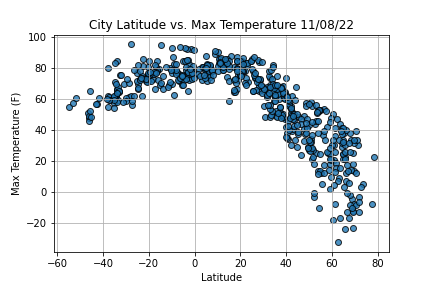
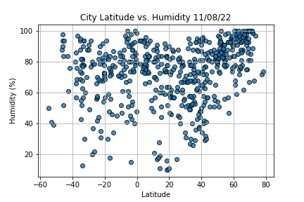
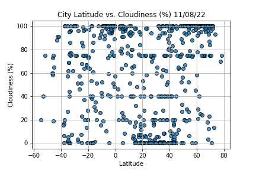
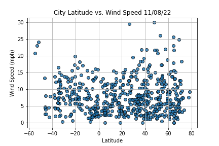

# World Weather Analysis

This repo served as a practice to interact with the open weather api. Information about different cities found with python module: citipy, was used as reference to collect the weather data and it was plotted on varied attributes as: Max temperature, Humidity, Cloudiness and Wind Speed for the two Hemispheres. 

The following pictures display the different relationship there is with the change in latitude for the set date. 

